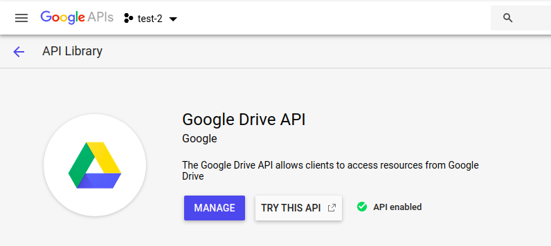
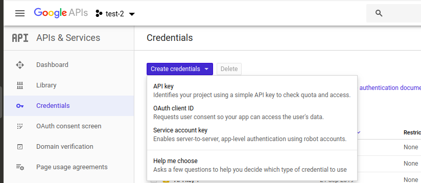
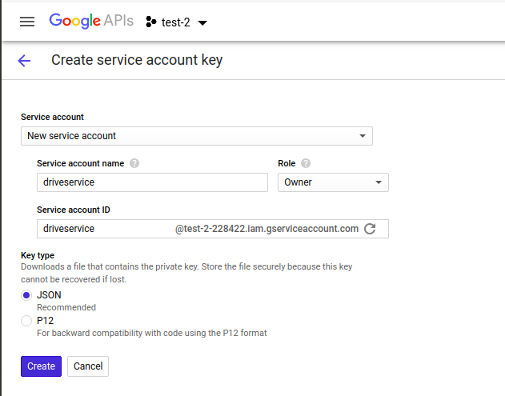
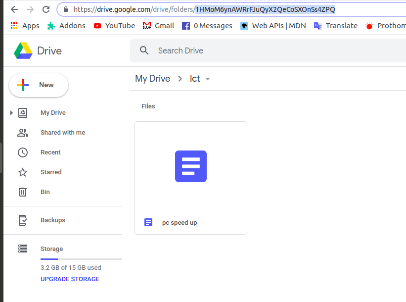
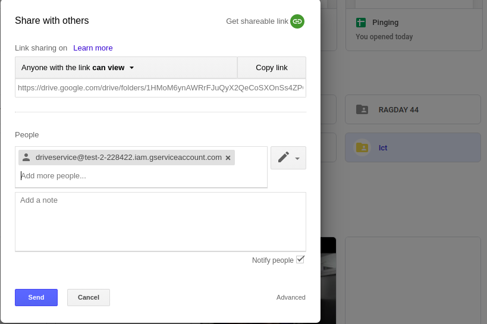

# NodeJS Discord Bot

### Doscord Tutorials

 - [5 - BASICS | Discord Bot Coding Tutorial #1 (Node JS & Discord JS](https://www.youtube.com/watch?v=-5jJaO17Gjs&list=PLQr7YhA3gqmIJyvQiZID8ZnR0bxDFrgnv)
 - [6 - DiscordJS (Updated 2018) Tutorial Ep. 1 - How to have your bot respond to user messages](https://www.youtube.com/watch?v=7rsPEsYxvxs&list=PL_cUvD4qzbkwZoWgG0hrSUCeQOPnjTAps)
 - [15 - EPISODE 1 | Part A - Getting Started with Discord js](https://www.youtube.com/watch?v=ORjzSh1w8Gw&list=PLeLrvnqwEnOasx86ozE-cdf1JagGcUlRf&index=1)
 - [10 - Coding Your Own Discord Bot - Discord.js - Setting Up Your Bot - *NEW*](https://www.youtube.com/watch?v=RZ02rw3NZnk&list=PLS6sInD7ThM0MTsu88RyxhTI187ScqRmm)

 ### Discordapp

 1. go to __https://discordapp.com/__ and register -> varify with mail and phone number -> Set server name
 2. __https://discordapp.com/__ -> Developers -> Developer Portal -> New Application -> NameAny
 3. Bot -> Add Bot -> AnyName
 4. Packages we need **discord.js, minimist, dotenv**
 5. `npm install discord.js minimist dotenv`
 6. Bot -> Copy Token -> Use it in the project
 7. Get Client ID from My Application -> General Information -> Copy Client ID
 8. Make sure app is running -> got to __https://discordapp.com/oauth2/authorize?client_id=YOUR_CLIENT_ID&scope=bot__
 7. Add a bot to a server -> select your server

---

 8. [Delete event](https://discord.js.org/#/docs/main/stable/class/Message)
 9. descord channel -> servarname dropdown -> server setting -> roles -> Click plus icon -> set new role name

 

 

 10. General permission -> turn on arministration permission

 

 11. Edit Channel -> permissions -> roles -> muted -> send message nothing

 

 

 12. Anyone who has the role able to send the message -> Allow anyone to mention this role

 
 
 13. to get the id message `\@muted` 

---

 14. remove role to show role by clicking on name in general message

 

 

 # Google Drive API

### Similer project

 - [GetFileList_js](https://github.com/tanaikech/GetFileList_js)

 <!--This is a Javascript library to retrieve the file list with the folder tree from the specific folder (publicly shared folders and own folders) of Google Drive.-->

 - [bandrec](https://github.com/derylspielman/bandrec)

 <!--Node.js script to convert recordings from wav to mp3 and upload them to Google Drive for sharing.-->

 - [Blackmail_Gallery_Project](https://github.com/regeanish/Blackmail_Gallery_Project)

 <!--Created successfully a photo sharing application where user an upload incriminating photos and post the list of demands. User needs to create a new account and login to his account to upload incriminating photos from his local drive to website. A login form was created for authenticating and validating by doing AJAX calls from client side to ser…-->

 - [gdrive-file-info](https://github.com/vladimyr/gdrive-file-info)

 <!--Google Drive node client for retrieving file info of publicly shared items.-->

### Drive API Tutorials

 - [Google Drive API V3 - Uploading Files to your Google Drive in Javascript](https://www.youtube.com/watch?v=VacgcdYz6-g)
 - [Google Picker API](https://www.youtube.com/watch?v=3V0LoGakHDU)
 - [Google Drive API: Uploading, Viewing, Downloading & Deleting Files](https://www.youtube.com/watch?v=aTv5t7oH6X8)
 - [Google Drive API V3 - Uploading Files to your Google Drive in Javascript](https://www.youtube.com/watch?v=VacgcdYz6-g)
 - [Google Drive API Tutorial in NodeJs - service account settings.](https://www.youtube.com/watch?v=gGSJpp6_ax0&t=397s)
 - [Google Drive API v3 - Manage Share & Set User Role Permissions - C#](https://www.youtube.com/watch?v=9VTHAiEbCB4)

 1. Enable google drive API and manage API

 

 2. Create service account key and download and rename

 

 

  3. Get ID of the folder 

 

 4. Go to google drive -> right click and share the folder 
 5. Get client email from service account download file

 